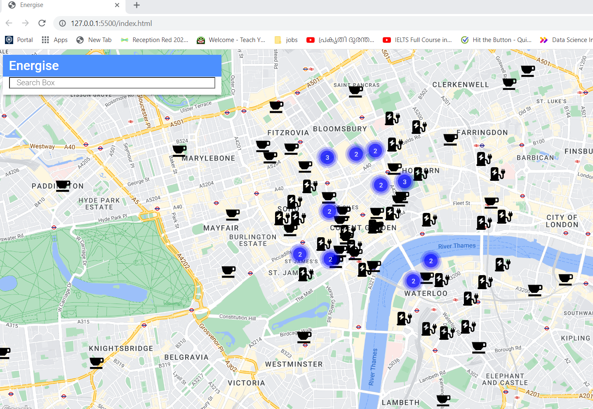
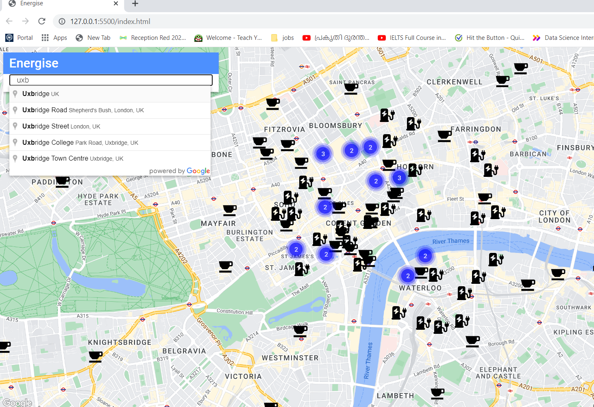
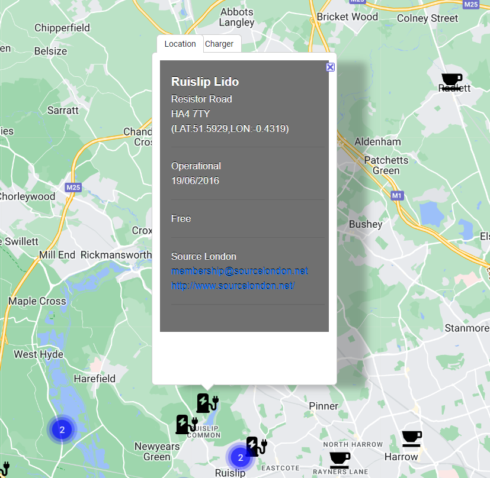

# energise
An app to find electric vehicle charging points near your location and show the nearest coffee shop where you can relax whilst your EV charges
Home page will display map of  current location with electric charging points and coffee shops.
There is also an auto-complete text box which allows the user to search for locations
once the place is selected from the drop dowm, list map will be centered around the selected place and highlight electric charging points and nearby coffee shops 
each locations can be clicked to get the details in a pop-up window

### Github URL 

https://github.com/JonHarrison/energise

### Deployment URL 

The deployed application can be accessed using below URL 

### Screenshots

The home page of Energise website

Map Search 

Charging point details 

