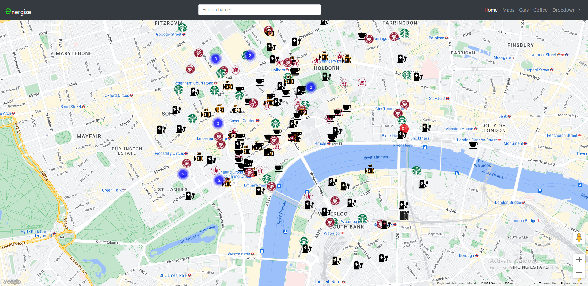
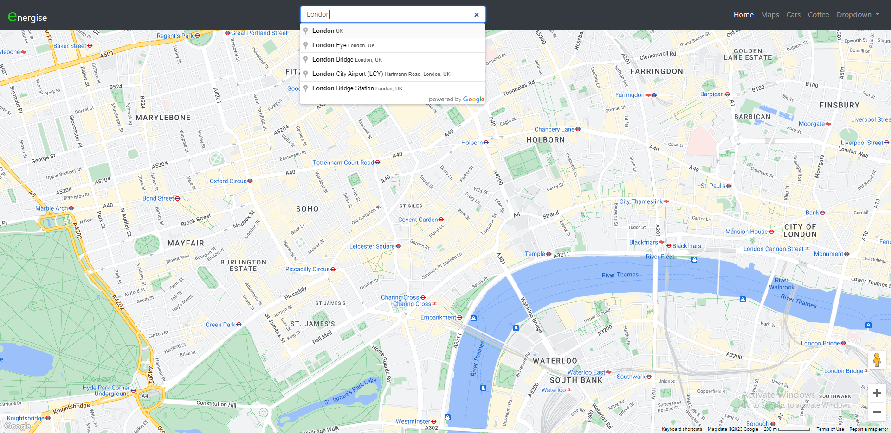
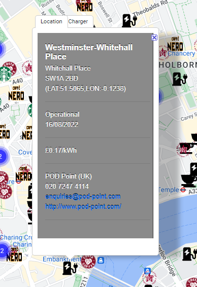
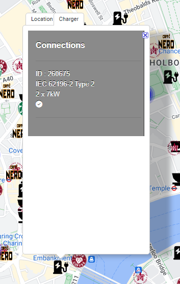
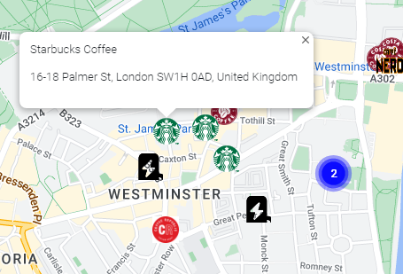

# energise

An app to find electric vehicle charging points near your location and show the nearest coffee shop where you can relax whilst your EV charges.

The home page displays a map of your current location (or any location you may wish to search for) with electric charging points and coffee shops. An auto-complete function is provided for the location search and once a location is selected, the map will be centered around the selected place and highlights electric charging points and nearby coffee shops. Each marker can be clicked to see additional details such as the address and the number and type of charge points available.

## User Story

```text
AS A green commuter and a coffee lover (or consumer of other hot or cold beverages) 
I WANT to locate any electric car charging points near to my location with nearby coffee shops where I can have a drink while my car is getting charged
SO THAT I can re-charge my car conveniently and also relax and enjoy my favorite beverage while waiting
```

## Acceptance Criteria

IT IS DONE

  * When a user searches for a location they are presented with a streetmap of that location and the surrounding area
  * The streetmap should show a marker at the location of any electric vehicle charging points within a defined area
  * The streetmap should show a marker at the location of any coffee shops within a defined area
  * When a user clicks on a coffee shop marker they should be presented with the name and address
  * When a user clicks on a charge point marker they should be presented with details of the point including
    * Address
    * Provider
    * Cost
    * Charge point types and number

## Tasks Completed

* Displays searchable map
  * containing EV charge points
  * and coffee shop locations
* EV charge point marker when cicked shows a tabbed pop-up info window containing details from the provider and quantity of charge points
* Coffee shop marker shows the company logo where available for easy identification
  * when clicked shows a pop-up info window containing the coffee shop name and address
  
## Challenges

* Initially the project was going to use the chargepoints API from the UK Government department of transport which provides real-time charger status and up to date information but we had to abandon this due to issues with CORS and revert to the openchargemap POI API instead
* Google deprecated tabbed info windows in v3 of the API so an alternative was required
* In certain areas many charge points are located in close proximity and this lead to a cluttered map with overlapping markers so a marker clusterer was implemented to group nearby charge points with a single marker indicating quantity which is expanded when selected

## Technologies Used

- HTML
- CSS
- Javascript
- Bootstrap v4.6.2
- jQuery v3.5.1
- Moment.js v2.24.0
- Fontawesome v6.2.0
- Google maps API v3
- Google places API
- openchargemap API v3

## Website images

The home page of Energise website


Map Search 
<br>


Charging point location details 
<br>


Charging point connection details
<br>


Coffee shop details
<br>


## Links

* [Link to the deployed website](https://jonharrison.github.io/energise/)
* [Link to the code repository](https://github.com/JonHarrison/energise)

## Resources:

* [Google Maps API ](https://developers.google.com/maps)
* [Google Maps API documentation ](https://developers.google.com/maps/documentation)
* [Electric charging point locations - OpenchargeMap API](https://openchargemap.org/site/develop#api)

## Contact

If you have any questions, please contact me at :

* GitHub profile : [JonHarrison](https://github.com/JonHarrison)
* Email : [******]()
* LinkedIn : [******]()
